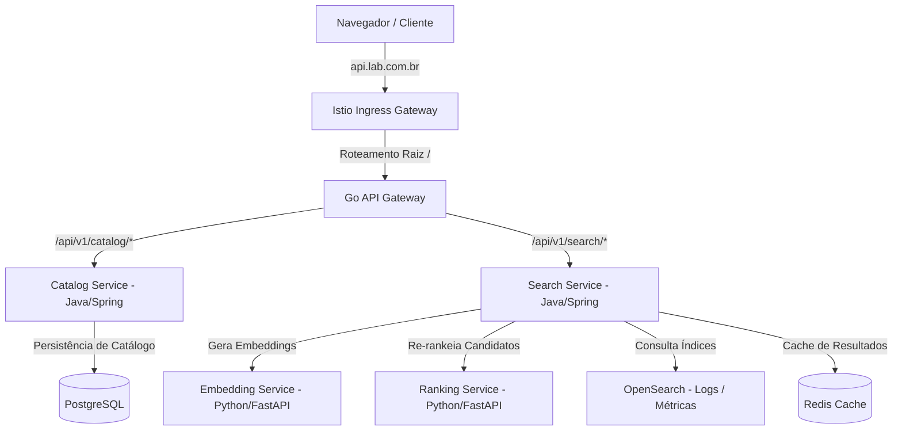

# 🚀 Kubernetes Lab - Marketplace Search System Playbook

Este repositório contém o ambiente Kubernetes completo, utilizando práticas recomendadas de produção para orquestração de microsserviços, GitOps de alta fidelidade e observabilidade correlacionada unificada.

---

## 📌 Arquitetura do Ecossistema

O laboratório é baseado em um cluster **Minikube** multi-nós e exposto via **Istio Ingress Gateway** com roteamento de domínios dedicados resolvidos por IP do LoadBalancer (**MetalLB**).



### 🔹 Microsserviços e Aplicações expostas
*   **Go API Gateway (`api-gateway`)**: Única aplicação externa exposta. Concentra a entrada do tráfego do sistema e distribui chamadas internamente.
*   **Catalog Service (`catalog-service`)**: Rápida API Java baseada em Spring Boot gerenciando os produtos cadastrados.
*   **Search Service (`search-service`)**: Motor inteligente Java orchestrando buscas semânticas vetoriais.
*   **Indexing Service (`indexing-service`)**: Ingestor de alta performance consumindo dados em streaming.
*   **Embedding Service (`embedding-service`)**: Serviço Python FastAPI gerando vetores densos usando modelos NLP.
*   **Ranking Service (`ranking-service`)**: Classificador de relevância de busca executando inferência ML.

---

## 🛠 Playbook de Instalação (Makefile)

O repositório disponibiliza um **Makefile** que funciona como seu orquestrador passo a passo.

### Targets Disponíveis

| Target | Comando | Descrição |
| :--- | :--- | :--- |
| `make prepare` | `bash scripts/01_prepare_cluster.sh` | Configura o Minikube (2 nós, 10GB RAM), ativa o **MetalLB** e instala o **Istio Service Mesh**. |
| `make certmanager-otel` | `bash scripts/03_install_certmanager_otel.sh` | Provisiona o **Cert-Manager** e os operadores nativos de **OpenTelemetry**. |
| `make observability` | `bash scripts/04_install_opensearch_observability.sh`| Implanta o core de tracing e logs: **OpenSearch** e **Jaeger Tracing**. |
| `make monitoring` | `bash scripts/05_install_prometheus_grafana_fluentbit.sh`| Implanta a infraestrutura de monitoramento nativo: **Prometheus**, **Grafana** e **Fluent-Bit**. |
| `make deploy-marketplace` | `bash scripts/05_deploy_marketplace.sh` | Implantar as definições declarativas do Marketplace via `kubectl apply` diretamente. |
| `make delete` | `minikube delete --all` | Destrói de forma limpa todas as instâncias e recursos locais criados. |
| `make all` | Executa todos em ordem | Provisiona todo o laboratório de ponta a ponta em sequência. |

---

## 🌐 Configuração de Acesso (DNS Local)

Para acessar as aplicações de forma nativa a partir do seu sistema host, obtenha o IP do LoadBalancer atribuído pelo MetalLB ao gateway Istio:

```bash
kubectl get svc -n istio-system istio-ingressgateway -o jsonpath='{.status.loadBalancer.ingress[0].ip}'
```

Adicione o IP retornado ao seu arquivo `/etc/hosts` associando-o aos domínios definidos na arquitetura (exemplo com o IP `192.168.49.200`):

```text
192.168.49.200 api.lab.com.br grafana.lab.com.br
```

---

## 🔗 Endpoints de Aplicação

Após configurar o arquivo de hosts, você terá os seguintes pontos de acesso ativos:

*   **API Gateway (Entrada Única)**: `http://api.lab.com.br/`
    *   *Endpoint de Busca*: `http://api.lab.com.br/api/v1/search/products?query=cadeira` (Retorna resultados de busca semântica em tempo real via OpenSearch e micro-serviços de ML).
    *   *Actuator Health*: `http://api.lab.com.br/api/v1/health` (Saúde interna do gateway).
*   **Grafana (Painéis e Métricas)**: `http://grafana.lab.com.br/`
    *   Acesso direto aos dashboards de monitoramento e análise de performance (incluindo logs centralizados correlacionados).

---

## 📊 SRE Centralized Unified Dashboard

Criado sob o padrão "Single Pane of Glass", o dashboard unificado do Grafana correlaciona os sinais vitais do sistema baseado na variável dinâmica `$service`.

### Recursos Integrados:
1.  **RED Signals**: Acompanhe o tráfego em tempo real (RPS - Requests Per Second), curvas de latência nos percentis mais críticos (P99, P95 e Média), e a taxa percentual de erros HTTP 5xx.
2.  **Saturação de Recursos**: Gráficos cruzados de CPU e Memória comparando o consumo real do container com os limites da Namespace no Kubernetes.
3.  **Logs Correlacionados**: Console interativo do OpenSearch embutido direto no painel com opção de filtragem rápida por Nível de Log (INFO, DEBUG, WARN, ERROR) e barras de pesquisa por texto.
4.  **Incidentes de Tracing (Jaeger)**: Tabela contendo requisições com erros ou latência excessiva (>200ms) vinculadas diretamente ao `trace_id` correspondente para depuração profunda.

### Tabs de Runtime Dedicadas (Métricas Internas):
*   ☕ **JVM Runtime (Java)**: Gráficos de memória heap/non-heap, taxa de Garbage Collection (GC) e número de threads ativas (para `catalog-service`, `search-service` e `indexing-service`).
*   🐹 **Go Runtime (Go)**: Acompanhamento de Goroutines ativas e alocação de memória de sistema (para the `api-gateway`).
*   🐍 **Python Runtime (Python)**: Uso de memória virtual e residente do processo Unix, contagem de threads do FastAPI e taxa de CPU (para `ml-ranking-service` e `ml-embedding-service`).

---

## 🔄 Fluxo de Deploy Declarativo Direto

O laboratório opera sob o paradigma de infraestrutura como código (IaC) e deploy declarativo via `kubectl`:
1. Todas as definições de microsserviços estão estruturadas no diretório `apps/marketplace/` em arquivos `manifest.yml`.
2. Para aplicar alterações permanentemente nas rotas ou configurações do gateway ou aplicações:
   * Realize a alteração localmente no arquivo do manifesto correspondente.
   * Aplique a alteração diretamente no cluster usando `kubectl apply -f apps/marketplace/<caminho_da_app>/manifest.yml` ou executando o target `make deploy-marketplace`.
   * As atualizações serão implementadas e o Kubernetes executará o rolling update de forma transparente.
